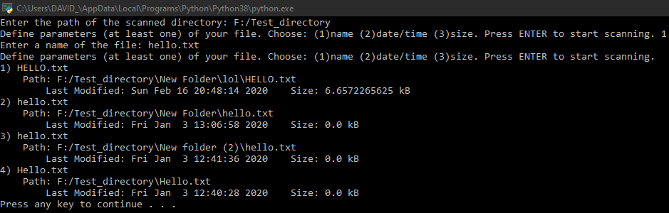

# Duplicate Files

[](https://www.python.org/downloads/release/python-380/)


## Summary
This program searches through a given folder including it's subfolders and prints a list of duplicate files with their locations and some info.
Files are duplicate if they've the same name, size or date/time.
You have to choose at least one of these parameters (other parameters are optional) before the start of searching.

## Installation
All you need is **Python**. You can download it [here](https://www.python.org/downloads/).
If you have Python, then just simply run [main.py](main.py).

## Usage
Duplicate Files can be used to find files with specific properties like name, date/time and size. Below are some examples to give you a better understading of what it looks like.

## Examples

Here is a **Test_directory** with some files and directories.

```
F:/Test_directory
│   index_2.txt
│   index_3.txt
│   Hello.txt
│   LoL.txt
│   ====.txt
│   %%%%.txt
│   kkkk.txt
│   Web.txt
│   Web.html
│   default.txt
│   New_web.txt
│
├───New Folder
│   │   hello.xlsx
│   │   lOl.txt
│   │   hello.txt
│   │
│   └───lol
│           HELLO.txt
│
└───New folder (2)
        hello.txt
        random_name.txt
```


<p align="center">
        
</p>
  
<p align="right">
        <br>
</p>

<p align="center">
        
</p>
  
Let's search the **Test_directory** by name - "hello.txt" (you have to write the whole name including the file extension, uppercase/lowercase don't matter). Here's the result.





Now we will add another parameter - size (7 kB).


Finally, we will add the date/time (16.2.2020 20:48).


You can see that the results of the program are correct.


The entire console output is also saved into a file **data.txt** located in the same directory as the main.py file, because the output can be so long that the console shows just a part of it.  

## Documentation
A lot of specific comments are written in the [main.py](main.py) file, but you can't really see them here on GitHub, so I recommend reading them in Visual Studio or your other code editor.
